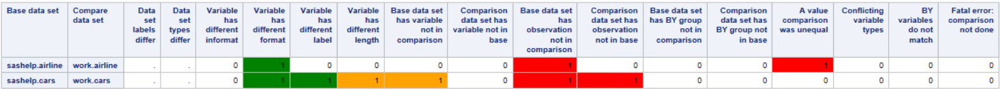

# SAS Macro Utilities
A collection of handy SAS utility macros to accomplish some specific tasks. 

## Compressing all character variables in a data set (`smu_compress_all_char_vars`)
Sometimes it can be convenient to remove certain characters in a character variable. For example, to get rid of some weird non-printing characters that SAS creates [when importing Excel-files](https://communities.sas.com/t5/SAS-Procedures/proc-import-XLSX-file-different-results-on-Linux-vs-Windows/m-p/388613). Or to get rid of a character that will be used as a delimiter before exporting to a delimited file (although arguably it is better to enclose these values in double quotes). 
In short, do anything that you can do with the compress-function at once to all variables in a data set.

## Comparing one or more data sets for differences (`smu_compare_tables`)
PROC COMPARE is a very powerful procedure to compare different data sets. However, it requires a lot of code to get basic things done. This macro uses the power of PROC COMPARE, but makes sure that the data sets are sorted properly, gives useful output by default (ODS and data sets) and makes it easy to summarize the results of comparing multiple data sets at once. 

The summary data set created can be printed to see at a glance what type of differences exist when comparing one or multiple sets of data. The printed summary output looks as follows and is illustrated in `examples/compare.sas`.

## Dropping empty variables from a data set (`smu_drop_empty_vars`)
Easily determine for a data set which variables only have missing values and get rid of them. 

## Counting missing for numeric and character variables (`smu_count_missings_per_var`)
PROC FREQ can be used to determine missing values for variables in a data set, but if you are purely interested in that it can be a bit cumbersome. This macro will output the count of missing and non-missing values for each variable in the input data set. 
